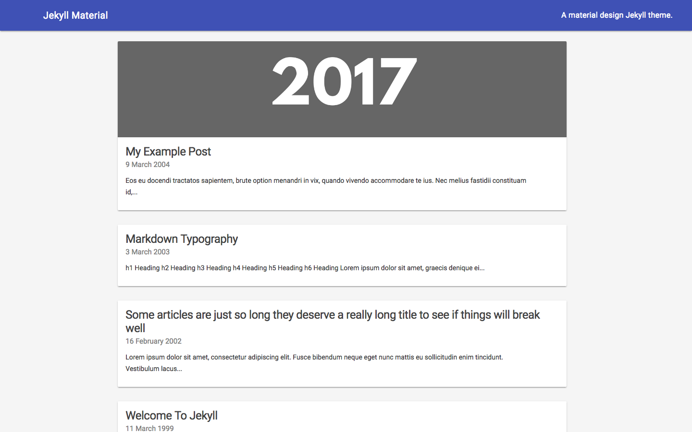

# Jekyll-Material
Material Design interfaces for jekyll.
It's pretty minimal, but leverages large type and drastic contrast to make a statement, on all devices.

Jekyll-Material was crafted with 💙 by Andre Christoga [@andrechristoga](https://twitter.com/andrechristoga).
___

## Getting Started

If you're completely new to Jekyll, I recommend checking out the documentation at [http://jekyllrb.com](http://jekyllrb.com)

### Installing Jekyll

If you don't have Jekyll already installed, you will need to go ahead and do that.
```shell
$ gem install jekyll
```

### Verify your Jekyll version

It's important to also check your version of Jekyll.
```shell
$ jekyll -v
jekyll 3.0.1
```

## Contributing
### Fork, then clone
Fork the repo, and then clone it so you've got the code locally.

### New feature
```shell
git checkout -b my-new-feature
git commit -am "New feature"
git push origin my-new-feature
```

### Other thing
```
vi file
git add file
git commit -m "Fixed ... "
git push -u origin master
```

## License
Jekyll-Material is licensed under MIT.
